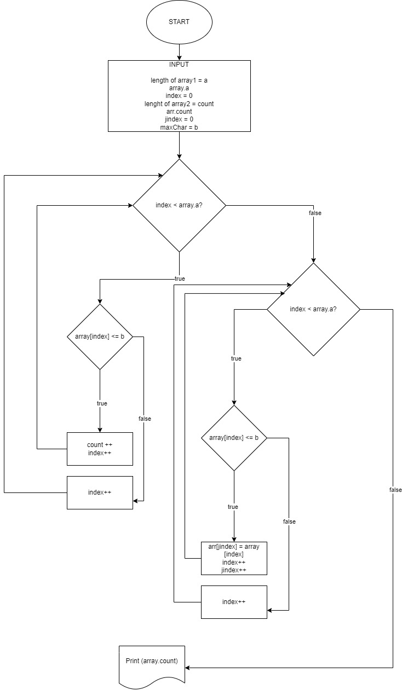

This program need only for one thing:

Написать программу, которая из имеющегося массива строк формирует новый массив из строк, длина которых меньше, либо равна 3 символам. Первоначальный массив можно ввести с клавиатуры, либо задать на старте выполнения алгоритма. При решении не рекомендуется пользоваться коллекциями, лучше обойтись исключительно массивами.

__Examples:__
- [“Hello”, “2”, “world”, “:-)”] → [“2”, “:-)”]
- [“1234”, “1567”, “-2”, “computer science”] → [“-2”]
- [“Russia”, “Denmark”, “Kazan”] → []

__Algorithm__ 

or just find file in folder with expansion *.jpg*

__Program__ you can find in file - *Program1.cs* 

## why for it?
Allright, this program - it's a just a set of methods which help for you find an elements in array which have 3 or less chars. 

Well, 
+ first method - __*LenghtOfArray*__ help you a set a length of your array,  

+ method  __*UrArray*__ helps you set element in your array, 

+ method  __*PrintArray*__ just output your written elements on screen. 

> Oh, all that's method need just for screening of our first array :) 

+ __*Test*__ - it's a method for checking an element in array and which of this have 3 or less chars. 

+ __*HowMany*__ - method of common output elements which have 3 or less chars in your array  

+__*ReadyArray*__ - method which help for you assemble your new array with elements which have a length 3 or less char